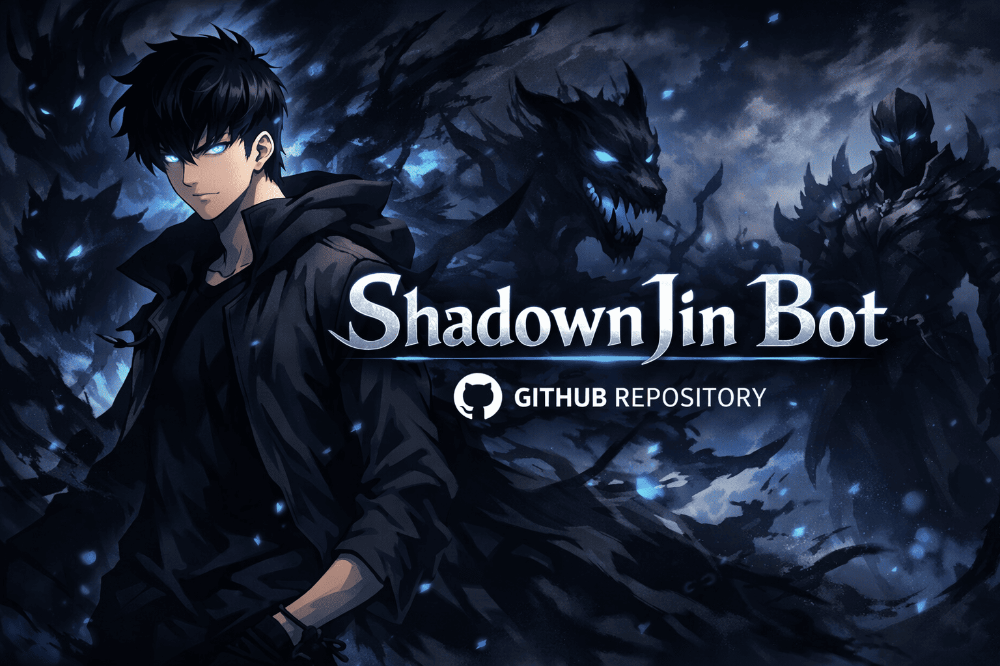

<h1 align="center">ShadownJin — Discord Bot (Solo Leveling Inspired)</h1>

Bot em JavaScript com **discord.js** e **Firestore**, arquitetura modular e suporte a XP, moderação e futuras integrações.

---

## 🛠️ Tecnologias Principais
### Linguagem e Ambiente
* **TypeScript (TS):** Utilizado como linguagem principal para tipagem forte, garantindo maior estabilidade e menos erros em tempo de execução.
* **Node.js 25:** O ambiente de *runtime* principal.
* **ES Modules (ESM):** O projeto utiliza a sintaxe moderna `import`/`export`, aproveitando os recursos assíncronos como `await import()`.
* **TSX:** Ferramenta de *runtime* para executar instantaneamente arquivos TypeScript e JSX, substituindo `nodemon` e `ts-node` em ambientes de desenvolvimento.

### Bibliotecas Principais
* **Discord.js (v14+):** Biblioteca principal para interagir com a API do Discord.
* **Firebase Admin SDK:** Utilizado para inicializar o **Firestore Database** e gerir a persistência de dados (XP, comandos, etc.).
* **Dotenv:** Para gestão e carregamento seguro de variáveis de ambiente a partir do ficheiro `.env`.

---

## 🌐 Features Implementar:
- [x] Base bot completa (Estrutura e Handlers);
- [x] Integração com Firebase;
- [x] Sistema de XP (com cooldown);
- [x] Estatísticas no servidor (Básico)
- [ ] Comandos modulares;
- [ ] Moderação automática (ativável/desativável);
- [ ] Dashboard Web estilo Loritta;
- [ ] Rotinas avançadas de economia/XP;
- [ ] Log de eventos;
- [ ] Sistema de inventário;
- [ ] Sistema de Loja;
- [ ] Sistema de Drop (Estilo RPG);

---

## 💬 Contato
Futuramente será adicionado contato oficial e links do dashboard.
