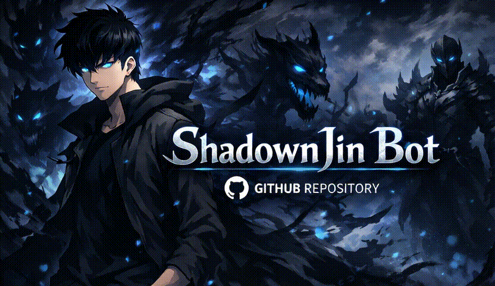

<p align="center">

</p>

<p align="center">

<h1 align="center">ShadownJin - Discord Bot modular inspirado em Solo Leveling</h1>

<p align="center">
<a href="https://github.com/ShadownJin/ShadownJin/actions/workflows/ci.yml"></a>
<a href="LICENSE"></a>
</p>

ShadownJin é um bot para Discord desenvolvido com foco em **arquitetura, escalabilidade e separação clara de responsabilidades**.  
Inspirado no conceito de progressão de *Solo Leveling*, o bot implementa sistemas de XP, economia e moderação como **camadas de domínio**, não como comandos isolados.

O objetivo do projeto não é ser apenas mais um bot, mas um **software bem estruturado**, pronto para evoluir com integrações como dashboard web, automações e sistemas RPG.

---

## 🧠 Arquitetura e Conceitos
- Estrutura baseada em **Commands, Events e Handlers**
- Separação clara entre:
  - Camada de Discord (interações e eventos)
  - Camada de serviços (XP, economia, cooldowns)
  - Camada de persistência (Firestore)
- Tipagem estendida do Client e variáveis de ambiente
- Código orientado à manutenção e evolução contínua

---

## 🛠️ Tecnologias Principais
### Linguagem e Ambiente
* **TypeScript (TS):** Utilizado como linguagem principal para tipagem forte, garantindo maior estabilidade e menos erros em tempo de execução.
* **Node.js 25:** O ambiente de *runtime* principal.
* **ES Modules (ESM):** O projeto utiliza a sintaxe moderna `import`/`export`, aproveitando os recursos assíncronos como `await import()`.
* **TSX:** Ferramenta de *runtime* para executar instantaneamente arquivos TypeScript e JSX, substituindo `nodemon` e `ts-node` em ambientes de desenvolvimento.

### Bibliotecas Principais
* **Discord.js (v14+):** Biblioteca principal para interagir com a API do Discord.
* **Firebase Admin SDK:** Utilizado para inicializar o **Firestore Database** e gerir a persistência de dados (XP, comandos, etc.).
* **Dotenv:** Para gestão e carregamento seguro de variáveis de ambiente a partir do ficheiro `.env`.
* **GitHub Actions** para CI
<br>

<p align="center">


</p>


---

## 🌐 Funcionalidades:

### Implementadas
- [x] Estrutura base do bot (handlers e loaders)
- [x] Integração com Firestore
- [x] Sistema de XP com cooldown
- [x] Estatísticas básicas por servidor
- [x] Comandos utilitários (ping, botinfo, userinfo)
- [x] Sistema inicial de moderação

### Em desenvolvimento
- [ ] Modularização completa de comandos
- [ ] Logs configuráveis por servidor
- [ ] Moderação automática (opt-in)

### Planejadas
- [ ] Sistema de economia avançado
- [ ] Inventário e loja (estilo RPG)
- [ ] Sistema de drops
- [ ] Dashboard web
- [ ] Configuração via interface gráfica

---

## 📄 Licença

Este projeto utiliza a [Shadown Source Available License (Shadown SAL)](https://github.com/ShadownJin/ShadownJin/blob/main/LICENCE).<br>
Consulte o arquivo LICENSE para mais detalhes.<br>
<a href="LICENSE"></a>

---

## 💬 Status do Projeto

Projeto em desenvolvimento ativo.
Documentação avançada, links oficiais e dashboard serão disponibilizados futuramente.

---

## 🚀 Executando o projeto localmente

1. Clone Repósitorio:
```bash
git clone https://github.com/ShadownJin/ShadownJin.git
cd ShadownJin
npm install
```

2. Crie o arquivo `.env` com as variaveis necessárias (Todas estão no arquivo `env.d.ts`)

3. Para build e execução em produção:
```bash
npm run build
npm start
```
